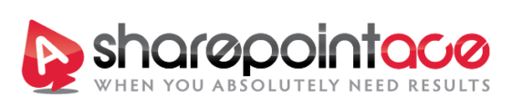

---
# You don't need to edit this file, it's empty on purpose.
# Edit theme's home layout instead if you wanna make some changes
# See: https://jekyllrb.com/docs/themes/#overriding-theme-defaults
layout: page
---

## SharePoint Hybrid with Office 365 Planning & Implementation

Did you know that before the end of 2016 about 50%+ of enterprise customers will be using a hybrid cloud environment?
 
Leading analyst organizations, and Microsoft themselves have realized that many organizations are unable, or unwilling, to move all collaboration workloads to the cloud.  Be that because of data privacy concerns, functionality requirements, or other reasons.  With this in mind, Microsoft has greatly improved the hybrid integration story with the new version of SharePoint.
 
At SharePoint Ace, we can help you determine which workloads you can successfully move to the Office 365, understanding technological and organizational expectations.  To date we have a number of customers who are taking advantage of the rapid innovation of the ‘Cloud First’ model, by leveraging productivity solutions such as Delve, Yammer, SharePoint Online and Search in Office 365.
 
We take a 5 step approach that yields tremendous results, and it all starts with an envisioning session, and understanding what assets you have today, and what makes the most sense to move to the cloud.  Once we understand what our ‘quick wins’ are that establish business value, we develop the rest of the roadmap including strategic items that may have a longer deployment timeline.  After design and planning, we’ll equip your users, administrators and developers with the right skills needed to take the reins and leverage these solutions to their utmost.
 
Business strategy and IT aligned, working in lock step to drive valuable solutions in your Enterprise
* Envision
* Plan
* Configure
* Deploy
* Training

## SharePoint Platform Upgrades and Migrations

A migration or an upgrade of SharePoint can strike fear in the hearts of the most seasoned Admins and Developers – Don’t go it alone!

While moving data from one environment or version of SharePoint to another is core to a migration, think of it differently.  Looking back, what could you do differently, what are the lessons learned? Our most successful customers view a migration not only as a chance to get the newest, shiniest bits, but as an opportunity to transform how they run SharePoint, capitalizing on often tough lessons learned.
Often this means rethinking Information Architecture (IA) and taxonomy, or in some cases, thinking about it for the first time!  Perhaps it’s time to provide a better quality of service to your end-users, and move away from that single WFE server configuration to something more scalable and ready to serve your enterprise.
Other times this can be a chance to ‘Make SharePoint look less like SharePoint’ by branding your intranet with company logos and colors, or making mobile-ready business applications for Executives on the go.

* Infrastructure and capacity planning
* SharePoint Farm Logical Design
* Intranet and collaboration site planning
* Taxonomy planning (used throughout your sites and content)
* Branding and Design including Responsive Design for mobile access to empower your workforce on the go
* Custom modern development of applications on top of SharePoint such as Single Page apps, custom Forms and Workflows

## Migration to Office 365 
 While we’d be glad to take your Network Shares and put them in OneDrive, we’d much rather put some strategy around it, planning which content goes where and restructuring it when it makes sense.  Why bring junk into your shiny new Office 365 environment?  Think of it as cleaning-house, starting anew in your content’s new cloud home.
You see, it’s more than just moving data from A to B, we’ll examine how it’s structured and if any changes can be made to make it more usable by end-users, and how it can best serve your Business.